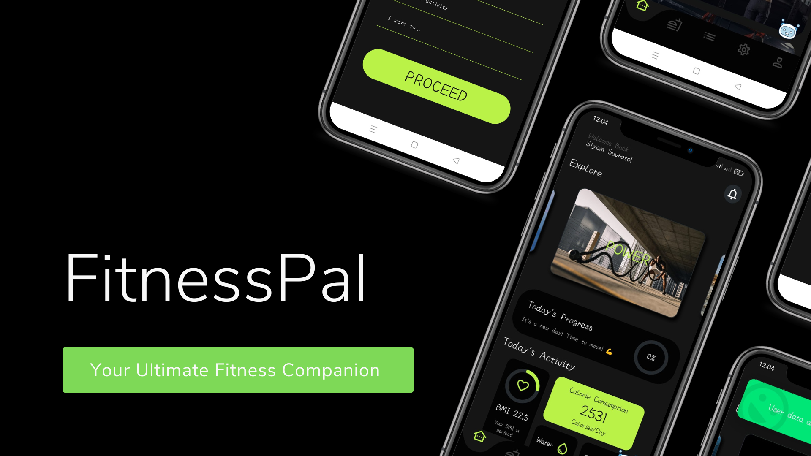
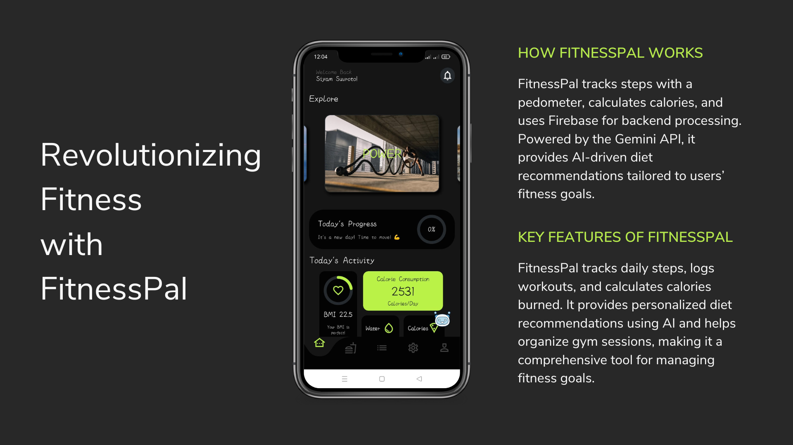

# FitnessPal App

FitnessPal is a comprehensive fitness tracking app that helps users monitor their steps, workouts, calories, and diet. With AI-powered personalized diet recommendations and seamless gym session management, FitnessPal offers a holistic approach to fitness.

## Key Features:
- **Step Tracking**: Monitor daily steps with real-time progress visuals.
- **Workout & Calorie Tracking**: Log exercises and track calories burned.
- **Gym Management**: Organize fitness sessions and track goals.
- **Distance Calculation**: Computes the total distance traveled.
- **AI Integration**: Uses **Gemini API** chatbot for personalized dietary guidance.




## How It Works
### Data Collection
- Step count is tracked using the device’s **native pedometer sensor**.
- Workouts are manually logged or auto-detected via sensors.
- AI chatbot, powered by **Gemini API**, provides dietary recommendations.

### Calorie Calculation
- Steps → Calories Burned Formula: `Calories = Steps * 0.04 kcal`
- Workouts → Calories Burned: Based on **duration & intensity** of exercise.

### Backend Services
- **Firebase** is used for authentication, real-time data synchronization, and user data management.
- **AI-powered Gemini API** processes calorie data to generate personalized diet plans.

## Installation
1. Clone the repository:
   ```sh
   git clone https://github.com/your-repo/FitnessPal.git
   ```
2. Navigate to the project folder:
   ```sh
   cd FitnessPal
   ```
3. Install dependencies:
   ```sh
   flutter pub get
   ```
4. Run the app:
   ```sh
   flutter run
   ```

## Technologies Used
- **Flutter**: Frontend framework for UI design.
- **Firebase**: Backend services for authentication & real-time data handling.
- **Gemini API**: AI-based personalized diet recommendations.
- **Sensors & Pedometer API**: For step and workout tracking.

## Future Plans
- Expand AI’s role in **workout recommendations**.
- Introduce **fitness challenges** and social community features.
- Add support for **multiple fitness goals** (muscle gain, endurance, etc.).

## License
This project is licensed under the **MIT License** - see the [LICENSE](LICENSE) file for details.
